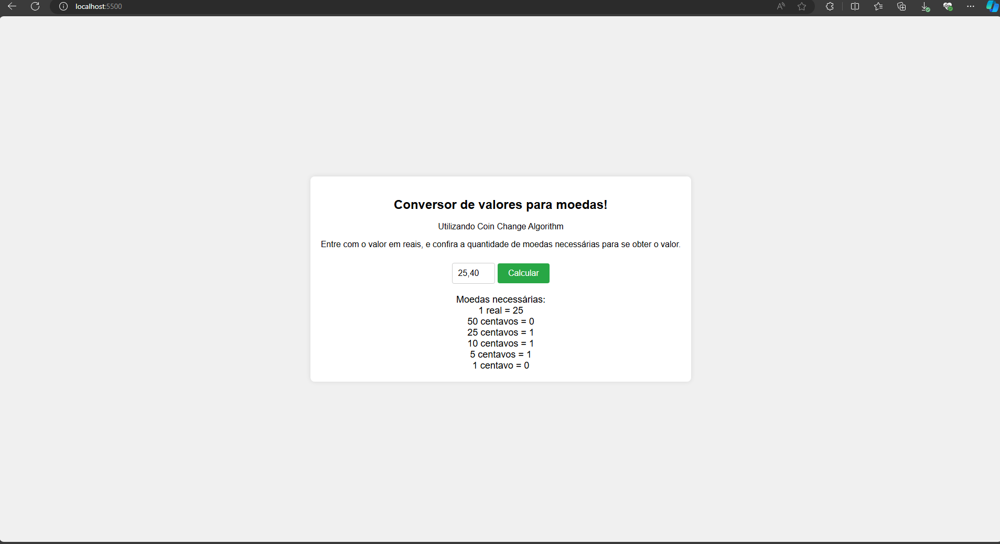

# Algoritmos Ambiciosos - Reais para Moedas

**Conteúdo da Disciplina**: Algoritmos Ambiciosos<br>

## Alunos
|Matrícula | Aluno |
| -- | -- |
| 20/0061216  |  Cleber de Oliveira Brant |
| 20/0044559  |  Wesley Lira Carvalho |

## Sobre 
O objetivo desse trabalho é demonstrar o uso do algoritmo das Moedas visto em sala de aula, aonde se trata de um algoritmo ambicioso.

## Screenshots


## Instalação 
**Linguagem**: HTML, Javascript e CSS<br>


## Uso 

Com o projeto aberto, acesse o terminal e vá até onde o projeto está salvo. Após isso, digite o seguinte comando:

```
npm install -g http-server
```

O comando acima permite que possa subir localmente o projeto em sua máquina. Após ter instalado o http-server, no mesmo terminal e na raiz do projeto insira o seguinte comando: **http-server**. Uma outra forma de subir localmente o projeto é instalando a extensão **Live Server** caso esteja pelo Visual Studio Code.

Ao subir o projeto, acesse a url do projeto e adicione a quantidade em Reais para obter o resultado de quantas moedas são necessárias.

## Outros 
- [Link da Apresentação](https://www.youtube.com/watch?v=FHHuIT2mGN0)
